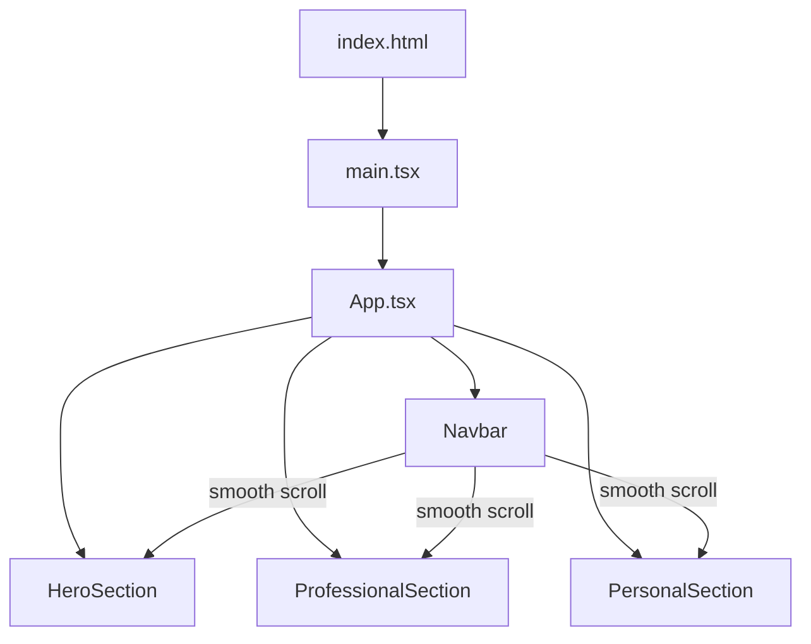

# Design Document: Angular to React Refactor

## Overview

This design describes the refactoring of the "about-me" personal portfolio website from Angular 14 to React 18 with TypeScript. The refactor replaces the Angular build system and component model with a Vite + React setup, fixes semantic HTML issues, removes Bootstrap/jQuery dependencies in favor of custom CSS Modules, and improves layout using modern CSS (flexbox). The visual design (dark theme, background image, panel styling) is preserved.

## Architecture

The application is a single-page static site built with:

- **React 18** with functional components and hooks
- **TypeScript** for type safety
- **Vite** as the build tool (fast dev server, optimized production builds)
- **CSS Modules** (`.module.css`) for component-scoped styling

No routing library is needed since this is a single-page site with anchor-based smooth scrolling.



## Components and Interfaces

### App (Root Component)
- Renders Navbar, HeroSection, ProfessionalSection, PersonalSection
- Manages the overall page layout with a dark-themed background

### Navbar
- Renders a `<nav>` element with links: Home, Professional, Personal
- Each link triggers smooth scroll to the corresponding section via anchor `id`
- Sticky positioning at the top of the viewport
- Dark theme styling (#282828 background)

### HeroSection (Welcome/Home)
- Renders a `<section>` with `id="home"`
- Displays: heading with name, subheading with role and location
- Bio paragraphs using `<p>` elements (not `<ul>`)
- LinkedIn link as an `<a>` tag opening in a new tab
- AWS certification badge images with descriptive alt text

### ProfessionalSection
- Renders a `<section>` with `id="professional"`
- Placeholder content indicating future professional details
- Extensible structure for adding resume, work history, etc.

### PersonalSection
- Renders a `<section>` with `id="personal"`
- Placeholder content indicating future personal content
- Extensible structure for hobbies, interests, etc.

## Data Models

This is a static site with no dynamic data. Content is hardcoded in components. The key data structures are:

```typescript
// Certification badge data
interface CertificationBadge {
  src: string;       // path to badge image
  alt: string;       // descriptive alt text
  pdfLink?: string;  // optional link to certificate PDF
}

// Navigation link data
interface NavLink {
  label: string;     // display text
  targetId: string;  // section id to scroll to
}
```

These are used inline within components rather than as separate data files, given the static nature of the site.

## Project Structure

```
├── public/
│   ├── images/
│   │   ├── aws-certified-cloud-practitioner.png
│   │   ├── aws-certified-solutions-architect-associate.png
│   │   ├── headshot.png
│   │   └── underConstruction.png
│   └── pdf/
│       ├── AWS Certified Cloud Practitioner certificate.pdf
│       └── AWS Certified Solutions Architect - Associate certificate.pdf
├── src/
│   ├── components/
│   │   ├── Navbar.tsx
│   │   ├── Navbar.module.css
│   │   ├── HeroSection.tsx
│   │   ├── HeroSection.module.css
│   │   ├── ProfessionalSection.tsx
│   │   ├── ProfessionalSection.module.css
│   │   ├── PersonalSection.tsx
│   │   └── PersonalSection.module.css
│   ├── App.tsx
│   ├── App.module.css
│   ├── index.css (global styles: reset, background, fonts)
│   └── main.tsx
├── index.html
├── package.json
├── tsconfig.json
└── vite.config.ts
```

## Correctness Properties

*A property is a characteristic or behavior that should hold true across all valid executions of a system — essentially, a formal statement about what the system should do. Properties serve as the bridge between human-readable specifications and machine-verifiable correctness guarantees.*

Based on the prework analysis, most acceptance criteria for this refactor are specific examples (static content checks, styling values) rather than universal properties. The two testable properties identified are:

### Property 1: Semantic HTML structure

*For any* rendered section component in the Portfolio_App, paragraph text content SHALL be wrapped in `<p>` elements (not `<ul>` elements), and the rendered output SHALL NOT contain `<html>`, `<body>`, or `<script>` tags.

**Validates: Requirements 3.1, 3.2**

### Property 2: Certification images have alt text

*For any* image rendered in the Certification_Section, the image element SHALL have a non-empty `alt` attribute containing descriptive text.

**Validates: Requirements 3.5**

## Error Handling

This is a static portfolio site with minimal runtime logic. Error handling considerations:

- **Missing images**: If a certification badge image fails to load, the alt text provides a fallback description
- **Broken links**: The LinkedIn link is hardcoded; no dynamic link resolution needed
- **Scroll targets**: If a nav link targets a section `id` that doesn't exist, the browser simply does nothing (graceful degradation)
- **Build errors**: TypeScript compilation catches type errors at build time

## Testing Strategy

### Unit Tests (Examples)
Given this is a static site refactor, the primary testing approach is example-based unit tests using React Testing Library:

- **Content preservation**: Verify all required text (name, bio, university, LinkedIn URL) renders correctly
- **Semantic structure**: Verify `<nav>`, `<main>`, `<section>` elements are present
- **Navbar links**: Verify three links (Home, Professional, Personal) with correct href anchors
- **Certification badges**: Verify both badge images render with correct src and alt text
- **Placeholder sections**: Verify Professional and Personal sections show placeholder content
- **Dark theme**: Verify key CSS classes/styles are applied

### Property-Based Tests
Using `fast-check` as the property-based testing library:

- **Property 1** (Semantic HTML): Generate random text content, render sections, verify no forbidden tags appear and text is in `<p>` elements
- **Property 2** (Alt text): Generate random certification badge data, render the section, verify all images have non-empty alt text

Each property test should run a minimum of 100 iterations. Each test should be tagged with:
- **Feature: angular-to-react-refactor, Property 1: Semantic HTML structure**
- **Feature: angular-to-react-refactor, Property 2: Certification images have alt text**

### Test Framework
- **Vitest** as the test runner (pairs well with Vite)
- **React Testing Library** for component rendering and DOM assertions
- **fast-check** for property-based testing
